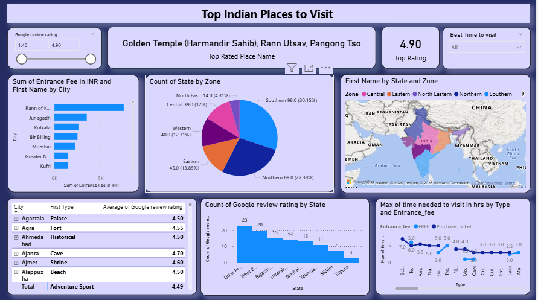

# 🇮🇳 Top Indian Places to Visit – Travel Analytics Dashboard

## 📌 Project Overview

This project analyzes travel and tourism data across India using Power BI to identify top-rated destinations, visitor preferences, and travel patterns. The dashboard provides insights into popular tourist places based on ratings, cost, and travel time.

## 🎯 Objective

* Identify top-rated tourist destinations in India
* Analyze travel cost (entrance fees) across locations
* Understand regional distribution of tourist places
* Evaluate time required to visit different types of locations

## 🛠️ Tools Used

* Power BI
* CSV Dataset

## 📂 Dataset Description

The dataset includes:

* City and State information
* Tourist place types (Temple, Beach, Fort, etc.)
* Google review ratings
* Entrance fees (INR)
* Time required to visit locations

## 📊 Dashboard Features

* KPI card showing top-rated place and highest rating
* Rating filter to explore destinations
* Cost analysis of tourist places (Entrance Fees)
* Zone-wise distribution of destinations (North, South, etc.)
* State-wise rating analysis
* Time required to visit by location type

## 📈 Key Insights

* Certain regions (like Southern and Northern India) have a higher concentration of tourist destinations
* Religious and historical places dominate top-rated locations
* Entrance fees vary significantly across cities and attraction types
* Most tourist places can be visited within 3–6 hours

## 📸 Dashboard Preview

## 📂 Files Included

* TopIndianPlaces.pbix
* Dataset (CSV file)

## 🚀 Conclusion

This dashboard helps travelers and tourism planners make informed decisions by identifying popular destinations, estimating travel costs, and understanding time requirements for visits.

## 👤 Author

Pranav Panara
